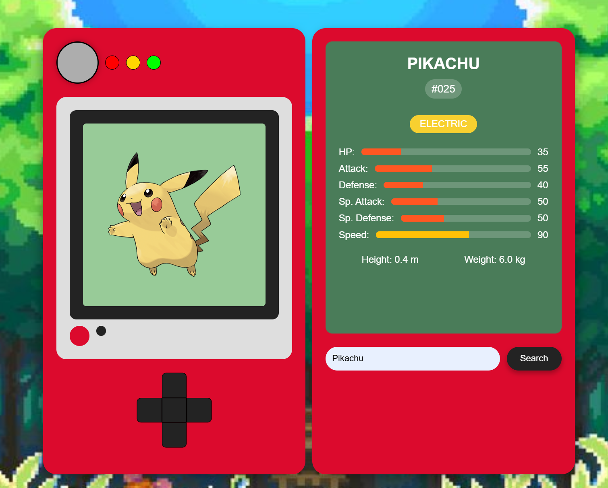

# Pokédex Web Application



## Overview
This project is an interactive Pokédex web application that allows users to search for and retrieve information about Pokémon by name or ID. The application features a visually appealing Pokédex-style interface that displays comprehensive information about each Pokémon including their stats, types, physical characteristics, and official artwork.

## Live Demo
Check out the live demo: [Pokédex Web Application](https://7sg56.github.io/my-pokedex/)

## Features
- **Realistic Pokédex Design**: Visually styled to resemble the iconic Pokédex from the Pokémon series
- **Pokémon Search**: Search for any Pokémon by name or ID number
- **Interactive UI Elements**: Working D-pad and lights that respond to user interaction
- **Comprehensive Pokémon Data**:
  - Name and ID number
  - Official artwork
  - Type(s) with color-coding
  - Base stats with visual bars (HP, Attack, Defense, Special Attack, Special Defense, Speed)
  - Height and weight information
- **Responsive Design**: Works on both desktop and mobile devices


## Installation
1. Clone this repository:
   ```
   git clone https://github.com/7sg56/my-pokedex.git
   ```
2. Navigate to the project directory:
   ```
   cd my-pokedex
   ```
3. Open `index.html` in your web browser.

No additional dependencies or installations are required. This is a client-side application that runs directly in the browser.

## Usage
1. Type a Pokémon's name (e.g., "pikachu") or ID number (e.g., "25") in the search box
2. Click the "Search" button or press Enter
3. View the detailed information that appears about the selected Pokémon
4. The D-pad is interactive for a more authentic Pokédex experience

## API Information
This application uses the [PokéAPI](https://pokeapi.co/), a free and open RESTful API that provides comprehensive data about the Pokémon franchise. Specifically, the application makes requests to:

```
https://pokeapi.co/api/v2/pokemon/{name or id}
```

The API returns data including:
- Basic information (name, ID)
- Sprites and artwork
- Type information
- Base stats
- Physical characteristics

## License
This project is open source and available under the [MIT License](LICENSE).

## Acknowledgements
- Pokémon data provided by [PokéAPI](https://pokeapi.co/)
- Pokémon is © Nintendo, Game Freak, and The Pokémon Company
- This is a fan project created for educational purposes
